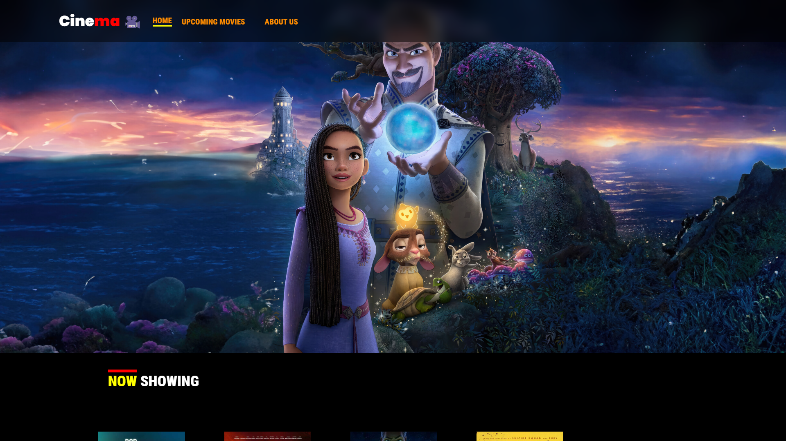
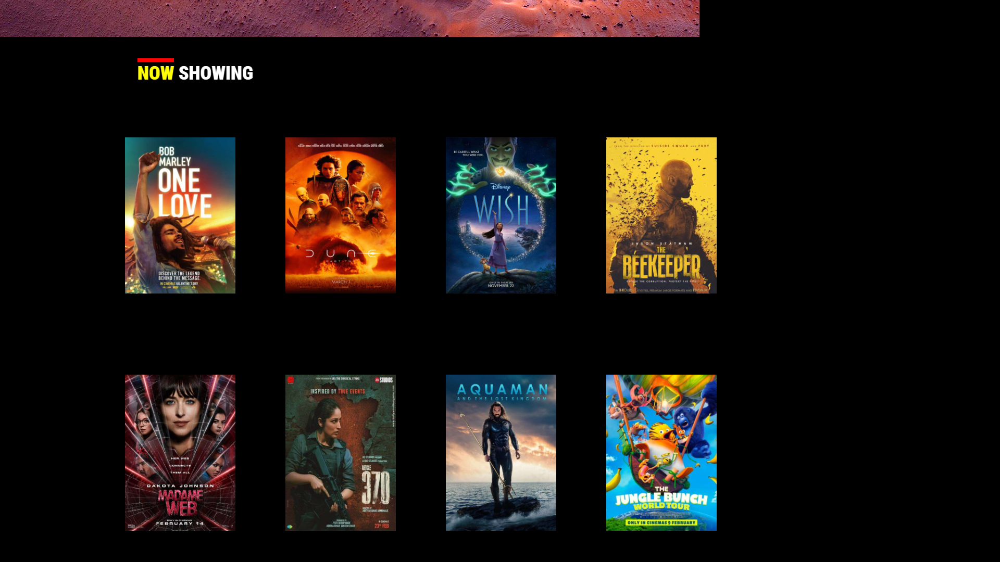
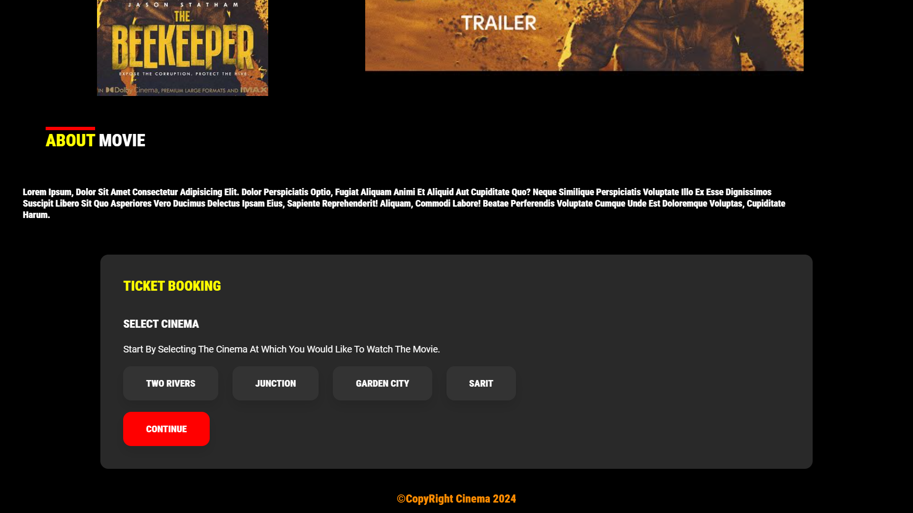
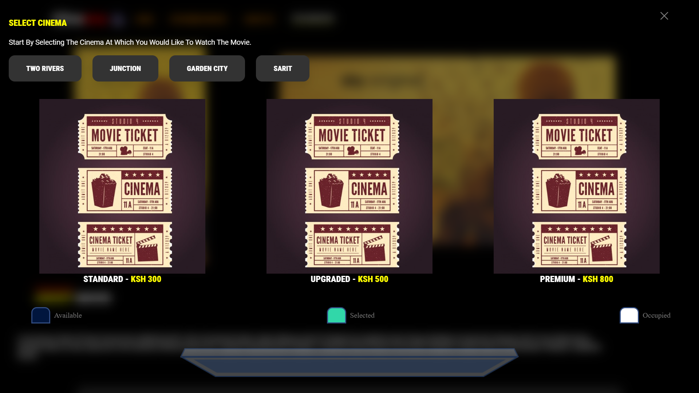
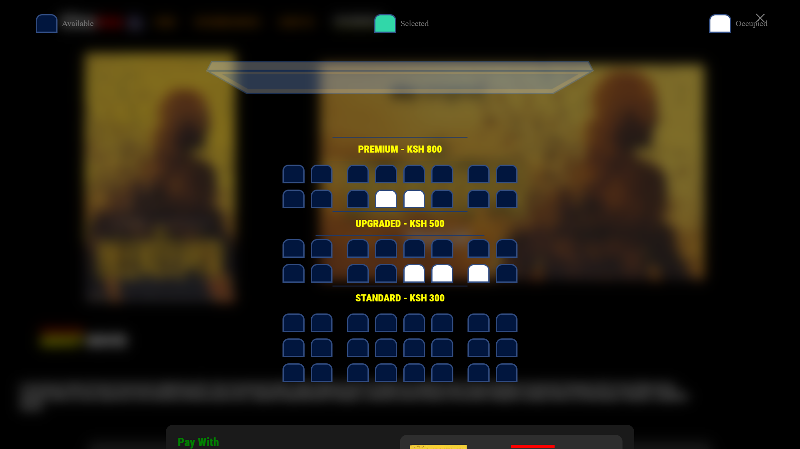
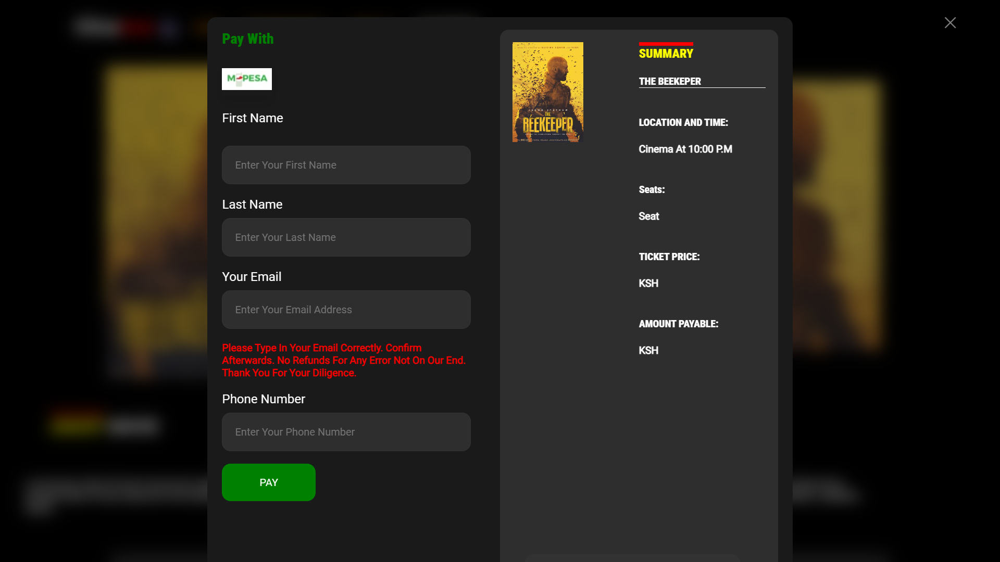

# Cinema Ticketing Website

Welcome to our Cinema Ticketing Website, the ultimate destination for movie lovers! This ReadMe file will guide you through the features, functionalities, and steps to get the most out of our platform. Whether you're a first-time visitor or a regular moviegoer, we’ve designed this website to make your movie ticket booking experience seamless, fun, and enjoyable!

## Table of Contents
1. [Overview](#overview)
2. [Features](#features)
3. [Getting Started](#getting-started)
4. [Booking a Ticket](#booking-a-ticket)
5. [Managing Your Account](#managing-your-account)
6. [Contributing](#contributing)
7. [License](#license)

## Overview
Our Cinema Ticketing Website is crafted to provide an effortless way to book movie tickets, explore upcoming releases, and manage your bookings. Enjoy the latest blockbusters, indie films, and special screenings at your fingertips.

## Features
- **Easy Ticket Booking**: Reserve your seats in just a few clicks.
- **Movie Listings**: Browse through an extensive list of current and upcoming movies.
- **Showtimes and Locations**: Find showtimes and cinema locations that suit your schedule.
- **Secure Payments**: Multiple payment options for a secure and convenient checkout process.
- **Special Offers**: Access exclusive discounts and promotions.
- **Reviews and Ratings**: Read and write movie reviews.

## Getting Started
To start using our website, follow these simple steps:

1. **Visit the Homepage**: Go to our website URL.
2. **Create an Account**: Sign up with your email or social media accounts.
3. **Browse Movies**: Explore the movie listings and find your favorite films.
4. **Book Tickets**: Select a movie, choose a showtime, and book your tickets.
5. **Enjoy the Show**: Head to the cinema with your e-ticket or printout.

## Booking a Ticket
Booking a ticket is quick and easy. Here’s how:

1. **Select a Movie**: Choose from the latest releases or search for a specific title.
2. **Choose a Showtime**: Pick a date and time that fits your schedule.
3. **Select Your Seats**: Use our interactive seating map to choose your preferred seats.
4. **Make Payment**: Complete the booking with our secure payment options.
5. **Receive Confirmation**: Get an email confirmation with your e-ticket.

## Contributing
We welcome contributions to enhance our website. To contribute:

1. Fork the repository.
2. Create a new branch.
3. Make your changes.
4. Submit a pull request.

## License
This project is licensed under the MIT License. See the [LICENSE](#) file for details.

Thank you for choosing our Cinema Ticketing Website! We hope you have a fantastic movie experience. Enjoy the show! 🎬🍿

---

Feel free to replace the placeholder `img` tags with your screenshots to provide a visual guide for users.
